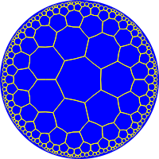
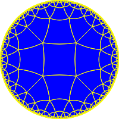
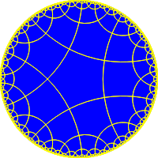
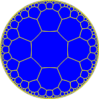
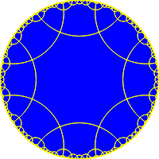
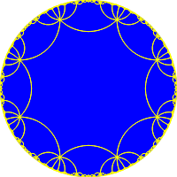

# hyperbolic
Confluent term rewriting rules for some hyperbolic Von Dyck groups.



In case the only words you understood in above description are "for" and "some",
here is the basic idea.

The [hyperbolic plane](https://en.wikipedia.org/wiki/Hyperbolic_geometry) is a form of non-Euclidian space. It's a space with a uniform
"negative curvature". I am not going into detail about it (Google it) but it's cool ;-).

## Von Dyck groups

The hyperbolic plane can be tiled with regular polygons, just like the normal plane.
If you do so, you can imagine somebody standing on the grid and walking from tile to tile.
Basically, ever trip an any such grid can be described by three operations:

1. Step one tile forward.
2. Turn one tile to the left.
3. Turn one tile to the right.

However, if we are using tiles with an odd number of edges (say, triangles or pentagons), 
then "Step one tile forward" will leave us not pointing at another tile.

So there's a trick: rather than let the operation be "Step one tile forward", let it be
"Step one tile forward and immediately turn 180°". In that way, you are guaranteed to be facing
a tile, namely the tile from which you just came!

Now consider the paths you can build from these fundamental steps. Two paths are considered
the same if they leave you at the same position and orientation. These paths form a
[Von Dyck group](https://groupprops.subwiki.org/wiki/Von_Dyck_group).

## Confluent term rewriting rules

So how are we going to determine if two paths should be considered identical?
Well, ley's first recap the operations e have and give them names:

* (a) Step one tile forward and turn 180°.
* (b) Turn one tile to the left.
* (B) Turn one tile to the right.

The convention here is that the upper-case operation is the inverse of the lower-case operation.
Note that operation a is its own inverse (try it out on your tile floor) so we don't need A.

Here are some rules which hold for all possible grids.

* bB = ε (ε is the empty path, i.e. no operations at all)
* Bb = ε 
* aa = ε

And here are rules for regular grids with polygons with p edges, where q edges come together at any corner.
Note on the notation: something like a<sup>3</sup> means aaa.

* b<sup>p</sup> = ε 
   (If you rotate around the entire tile, you get back at the beginning.)

* (ab)<sup>q</sup> = ε 
   (The operation ab is a rotation around a corner. Try it on your tile floor! Doing it q times will leave you back
     at the beginning.)

Now we can apply those rules on some path, concluding that for (p, q) = (7, 3) the path bAAbA is equivalent to
abaab. But we really want to produce somehow a *canonical* path given any path. How to do this?

Well, I will not go into details but there is an algorithm, 
called [Knuth-Bendix](https://en.wikipedia.org/wiki/Knuth%E2%80%93Bendix_completion_algorithm), which will solve this problem for us.
It produces, given a bunch of rules such as the above, a set of *confluent rewriting rules*. That means that if
you apply each of these rules repeatedly until no one of them applies any more, you are guaranteed to have produced
a canonical form for the path. 

I used [CoCalc](https://cocalc.com) to do the calculations for me. Since they took some time, I decided to save the results here ;-).

The rules are described for a few possible values for p and q in the hyperbolic.json file. Basically, this is just a bunch of string substitutions you have to run until no further applies.

## The tilings

Here are pictures of all the provided tilings.
These are drawn using the [Poincaré disk model](https://en.wikipedia.org/wiki/Poincar%C3%A9_disk_model).

p = 4, q = 5: 

p = 5, q = 4: 

p = 7, q = 3: 

p = 8, q = 3: 

p = 8, q = 4: 

p = 8, q = 8: 

## Fundamental triangle

For a regular grid of polygons, the *fundamental triangle* is the triangle ABC between the following points:

* (A) The center of a tile.
* (B) The center of some *edge* on the same tile as A.
* (C) One corner on the same edge as B.

Note that the angle at point B will be 90°, so it is a straight triangle.
It is useful to know the distances AB and AC given the grid parameters p and q.

* distance AB = acosh(cos(π/q) / sin(π/p))
* distance AC = acosh(1 / (tan(π/p) * tan(π/q) ) )

## Coordinates and distances on the hyperbolic plane

Points on the hyperbolic plane can be represented by
a triple (x, y, z) ∈ ℝ<sup>3</sup>, which must satisfy

-x<sup>2</sup> - y<sup>2</sup> + z<sup>2</sup> = 1.

Note that this is analogous to representing points on the sphere by (x, y, z) ∈ ℝ<sup>3</sup> which
satisfy x<sup>2</sup> + y<sup>2</sup> + z<sup>2</sup> = 1. In both cases, alternative coordinate systems
exist (e.g. latitude/longitude), but the presented one has some advantages:

1. There are no singularities. (In latitude/longitude systems: what is the longitude of the north pole?)
2. All distance-preserving transformations can be represented as 3x3 matrices.

The origin is at the point (0, 0, 1). A rotation of φ around the origin is represented by the matrix
```
        ⎧  cos φ  sin φ  0 ⎫
 R(φ) = ⎪ -sin φ  cos φ  0 ⎪
        ⎩    0      0    1 ⎭
```

Similarly, a translation over distance d in the x direction is represented by
```
        ⎧ cosh d  0  sinh d ⎫
 T(d) = ⎪   0     1    0    ⎪
        ⎩ sinh d  0  cosh d ⎭
```

Given a tiling with parameters p and q, we can now establish the corresponding matrices for each of the operations a, b, and B:
```
   M(a) = R(π) * T(2 acosh(cos(π/q) / sin(π/p)))
   M(b) = R(2π/p)
   M(B) = R(-2π/p)
```
